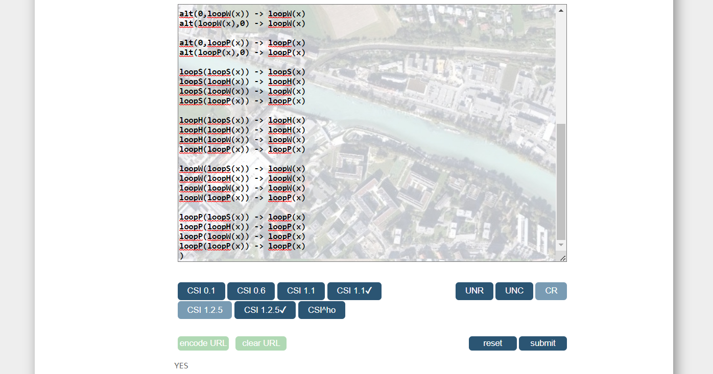

# Proof of the convergence of a Term Rewrite System to compute normal forms of Interactions


Interactions encode as binary tree terms behavioral models similar to Message Sequence Charts and UML Sequence Diagrams.

Several interactions even though they are syntactically distinct may still express exactly the same set of behaviors.
We can identify these syntactically distinct but semantically equivalent interactions via rewriting.


In this repository we present a simple Term Rewrite System which we prove to be convergent and which can be used to relate such interactions and, for any group of such semantically equivalent interactions, to compute a unique representative.


## Definition of the Term Rewrite System


Each rewrite rule of the TRS corresponds to an algebraic property of the interaction language's operators (see [this coq proof](https://github.com/erwanM974/coq_hibou_label_equivalent_terms)).

The resulting Term Rewrite System is encoded in WST format (international WorkShop on Termination,
see [WST](termination-portal.org/wiki/WST)) below:

```
(VAR x)
(THEORY (AC alt) (AC par) (A strict) (A seq))
(RULES

strict(x,0) -> x  
seq(x,0) -> x  
par(x,0) -> x

strict(0,x) -> x  
seq(0,x) -> x  
par(0,x) -> x

alt(x,x) -> x

loopS(0) -> 0 
loopH(0) -> 0  
loopW(0) -> 0  
loopP(0) -> 0

alt(0,loopS(x)) -> loopS(x)
alt(loopS(x),0) -> loopS(x)

alt(0,loopH(x)) -> loopH(x)
alt(loopH(x),0) -> loopH(x)

alt(0,loopW(x)) -> loopW(x)
alt(loopW(x),0) -> loopW(x)

alt(0,loopP(x)) -> loopP(x)
alt(loopP(x),0) -> loopP(x)

loopS(loopS(x)) -> loopS(x)
loopS(loopH(x)) -> loopH(x)
loopS(loopW(x)) -> loopW(x)
loopS(loopP(x)) -> loopP(x)

loopH(loopS(x)) -> loopH(x)
loopH(loopH(x)) -> loopH(x)
loopH(loopW(x)) -> loopW(x)
loopH(loopP(x)) -> loopP(x)

loopW(loopS(x)) -> loopW(x)
loopW(loopH(x)) -> loopW(x)
loopW(loopW(x)) -> loopW(x)
loopW(loopP(x)) -> loopP(x)

loopP(loopS(x)) -> loopP(x)
loopP(loopH(x)) -> loopP(x)
loopP(loopW(x)) -> loopP(x)
loopP(loopP(x)) -> loopP(x)
)
```

Given variable `x`, each line in `(RULES ...)` corresponds to the application of a rule.
Some operators of the language are associative and/or commutative.
We declare this in `(THEORY ...)` with, for instance 
the non-deterministic choice `alt` operator being associative and commutative `AC`
and the weak sequencing `seq` operator being only associative `A`.


Classical Term Rewriting allows the application of rewrite rules modulo substitution of variables
and application at any position in the term.
This enables e.g. `seq(x,loopS(0)) -> seq(x,0) -> x` by applying 
rule 8 at position 1 within the initial term
and then rule 2 at the root position.


With Associative-Commutative Rewriting, we can also apply those rewrite rules modulo the equivalence classes
defined by the THEORY made of the rules
`f(x,y) <-> f(y,x)` for commutative operators
and `f(x,f(y,z)) <-> f(f(x,y),z)` for associative operators.
For instance, this allows the transformation `alt(alt(0,x),alt(y,0)) -> alt(x,alt(y,0))`.


As each rewrite rule corresponds to an algebraic property of the corresponding operators,
they each preserve the trace semantics of interactions.
This then implies that the application of the TRS preserves the semantics.
Hence, any two terms that can be related by the application of the TRS are semantically equivalent.


## Convergence

Convergence of a TRS *->* makes so that, for any term *t*, there exists a unique irreducible term *t'* 
(i.e. a term that cannot be rewritten anymore) such that *t -\*>t'*.

In order to prove convergence, it suffices to prove termination and confluence.

The termination and confluence of TRS can be proven using several
publicly available tools:
- the TTT2 tool (version 1.20), which web interface is available
[here](http://colo6-c703.uibk.ac.at/ttt2/web/) enables proving termination
- the CSI tool (version 1.2.5) which web interface is available
  [here](http://colo6-c703.uibk.ac.at/csi/) enables proving confluence

It suffices to provide them with the WST encoding of the TRS and configure them appropriately.

The output of TTT2 is the following, proving termination:


The output of CSI is the following, proving confluence:




